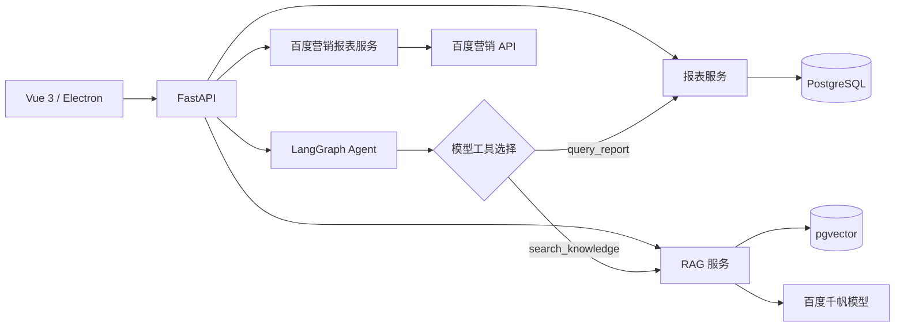

# 百度营销智能运营 Agent

一个面向广告投放分析场景的全栈 AI 应用。项目将结构化报表查询、RAG 知识问答、模型工具调用和 LangGraph 工作流整合到同一套 Web / Electron 客户端中，并通过可验证引用、后端指标计算和严格工具边界控制模型输出。


## 项目亮点

- **有边界的 AI Agent**：模型通过原生 Tool Calling 自主选择报表查询或知识检索，LangGraph 负责状态、条件分支、错误处理与终止条件。
- **可核验的分析结果**：报表数字来自后端实际查询，知识结论必须引用本次检索片段；前端同时展示工具调用记录、数据依据和原文引用。
- **RAG 知识问答**：文档切分后写入 Supabase PostgreSQL + pgvector，使用百度千帆 Embedding 检索并由 Chat 模型生成带引用回答。
- **真实百度营销报表接入**：独立查询新兴趣报表和地域报表，支持服务端分页、业务状态校验、精度保留、超时与认证失败处理。
- **浏览器与桌面端复用**：Vue 页面同时运行于 Vite 浏览器环境和 Electron 桌面客户端。
- **安全与可靠性约束**：认证信息只存在后端；不执行模型生成的 SQL、Python 或 Shell；不开放预算修改或广告账户写操作。

## 功能模块

| 模块 | 主要能力 | 数据来源 |
| --- | --- | --- |
| 投放数据看板 | 日期与计划筛选、日报明细、汇总指标、零分母处理 | PostgreSQL 演示样本 |
| 知识问答 | 向量检索、答案生成、引用片段和相似度展示 | Supabase / pgvector + 百度千帆 |
| 智能分析 | 模型自主选工具、LangGraph 编排、事实与引用校验、能力边界提示 | 样本报表 + 知识库 |
| 百度投放数据 | 新兴趣报表、地域报表、服务端分页、空数据与失败重试 | 百度营销 API |

百度投放数据是独立功能。当前 Agent 的 `query_report` 查询项目报表表，不会把真实百度账户数据自动送入模型，也不会修改广告预算或投放设置。

## 架构



智能分析流程：

```text
用户问题与筛选条件
        ↓
模型决定是否调用工具
        ↓
后端校验工具白名单和参数
        ↓
执行报表查询 / 知识检索
        ↓
工具结果返回模型，判断依据是否充分
        ↓
生成分析并校验事实 ID、引用 ID 和能力边界
        ↓
返回分析、数据依据、知识引用和实际执行记录
```

Agent 最多执行 3 次工具调用、4 轮模型决策和 12 个图步骤，总执行时间限制为 120 秒。单个工具失败时保留其他成功依据，并明确说明失败对结论的影响。

## 关键工程设计

### 指标由后端计算

金额使用 `Decimal`，接口以字符串返回，避免浮点误差。CTR、CPC 等指标由后端基于汇总分子和分母重新计算，模型只负责解释。分母为零时返回 `null`，前端显示 `—`。

### 引用与事实约束

知识工具只负责检索，不在工具内部再次生成答案。最终分析中的 `citation_ids` 必须属于本次检索结果，`fact_ids` 必须属于本次报表查询结果；校验失败的生成内容不会展示。

### 工具调用边界

Agent 仅开放：

- `query_report`：只读查询项目报表。
- `search_knowledge`：只读检索知识片段。

模型不能指定外部 URL、执行任意 SQL 或调用系统命令。工具参数由 Pydantic 严格校验，额外字段直接拒绝。

### 请求一致性

前端使用 `AbortController` 取消旧请求，并用请求序号防止旧响应覆盖新结果。切换百度报表页签或修改日期后会清空旧结果并将分页重置到第一页。

## 技术栈

**前端**

- Vue 3、TypeScript、Vite
- Electron
- Playwright

**后端与 AI**

- Python 3.12、FastAPI、Pydantic
- LangGraph 原生状态图
- 百度千帆 Chat / Embedding API
- HTTPX、SQLAlchemy、psycopg

**数据层**

- Supabase PostgreSQL
- pgvector

## 项目结构

```text
backend/
  app/
    routes/                 FastAPI 路由
    services/               报表、知识检索、Agent 与百度报告服务
    agent_models.py         Agent 输入、工具参数和分析结构
    baidu_report_models.py  百度报告查询与响应校验
    rag_config.py           数据库及模型配置
    main.py                 应用入口与错误处理
  tests/                    后端测试
  requirements.lock        Python 完整依赖锁
frontend/
  electron/main.cjs        Electron 主进程与安全设置
  src/api/                 前端请求封装
  src/components/          报表、知识问答和智能分析组件
  src/types/               TypeScript 接口类型
  tests/                   浏览器与 Electron 测试
data/
  knowledge/               知识库源文件
  seed/                    可重复生成的样本报表
scripts/
  project.ps1              检查、安装和启动入口
```

## 本地运行

已验证环境：Windows 11、Python 3.12、Node.js 20.19+、npm 10。Electron 使用仓库内安装的 Node 22 工具链，不修改系统全局环境。

### 1. 配置环境变量

```powershell
Copy-Item backend/.env.example backend/.env
Copy-Item frontend/.env.example frontend/.env.local
```

编辑 `backend/.env`，填写自己的数据库和模型配置。需要查询真实百度投放数据时，再填写独立的百度营销认证：

```dotenv
DATABASE_URL=postgresql+psycopg://...

EMBEDDING_BASE_URL=https://qianfan.baidubce.com/v2
EMBEDDING_API_KEY=
EMBEDDING_MODEL=embedding-v1
EMBEDDING_DIMENSIONS=384

CHAT_BASE_URL=https://qianfan.baidubce.com/v2
CHAT_API_KEY=
CHAT_MODEL=

BAIDU_MARKETING_ACCESS_TOKEN=
BAIDU_MARKETING_USER_NAME=
```

真实 `.env` 已被 `.gitignore` 排除。所有密钥仅由 FastAPI 后端读取，不要放入 `VITE_*` 变量或提交到仓库。

### 2. 安装依赖

在仓库根目录执行：

```powershell
powershell.exe -NoProfile -ExecutionPolicy Bypass -File scripts/project.ps1 -Action check
powershell.exe -NoProfile -ExecutionPolicy Bypass -File scripts/project.ps1 -Action install
```

### 3. 启动后端与前端

终端一：

```powershell
powershell.exe -NoProfile -ExecutionPolicy Bypass -File scripts/project.ps1 -Action backend
```

终端二：

```powershell
powershell.exe -NoProfile -ExecutionPolicy Bypass -File scripts/project.ps1 -Action frontend
```

访问：

- Web：<http://127.0.0.1:5173>
- FastAPI 文档：<http://127.0.0.1:8000/docs>

启动 Electron：

```powershell
powershell.exe -NoProfile -ExecutionPolicy Bypass -File scripts/project.ps1 -Action electron
```

应用启动不会自动创建表、导入样本或重建向量库。运行前需要准备与项目模型匹配的 PostgreSQL 表和 pgvector 索引。

## 主要 API

| 方法 | 路径 | 说明 |
| --- | --- | --- |
| GET | `/api/reports/campaigns` | 查询项目投放日报与汇总 |
| GET | `/api/knowledge/status` | 检查知识库状态 |
| POST | `/api/knowledge/search` | 仅检索知识片段 |
| POST | `/api/knowledge/ask` | 生成带引用的知识回答 |
| GET | `/api/agent/metadata` | 获取 Agent 数据范围与执行限制 |
| POST | `/api/agent/analyze` | 执行智能分析流程 |
| GET | `/api/baidu-reports/status` | 检查百度营销认证是否配置 |
| POST | `/api/baidu-reports/query` | 查询新兴趣或地域报表 |

## 验证

```powershell
# 后端
Set-Location backend
.\.venv\Scripts\python.exe -m pytest -q
.\.venv\Scripts\python.exe -m pip check
```

```powershell
# 前端
Set-Location frontend
..\scripts\npm-local.cmd run build
..\scripts\npm-local.cmd run test:ui
```

当前后端测试覆盖报表计算、RAG 引用、Agent 工具边界、非法参数、调用次数和超时，以及百度报告的分页、空数据、零值、认证失败和响应结构校验。UI 测试覆盖浏览器和 Electron 的加载、失败、重试、重复提交及旧请求保护。

百度营销真实联调曾验证：新兴趣报表可查询；地域报表在同一日期快照下返回 763 条、4 页，第一页和第二页各 200 条、末页 163 条。该数量只代表当次账户与日期范围，不写入业务逻辑。

## 安全与数据说明

- 仓库中的投放样本和知识资料用于功能演示，不代表真实业务账户。
- 百度营销认证、数据库连接和模型密钥只保存在本地后端环境变量中。
- 百度投放数据直接查询后返回前端，不写入项目数据库。
- 系统不会自动调价、修改预算、创建广告或执行其他账户操作。
- 知识检索相似度用于排序，不等同于答案正确率。
- 缺少收入、毛利和完整成本时，Agent 不生成盈利排名或确定性预算结论。

## 可继续演进

- 增加登录、租户隔离、RBAC 与接口限流。
- 将外部调用改造成可恢复的后台任务，并加入重试、熔断和监控。
- 建立离线评测集，持续评估工具选择、引用准确性和分析质量。
- 为真实百度报表增加增量同步、稳定快照和跨页一致性机制。
- 增加容器化部署、CI/CD、可观测性和桌面安装包。

## 面试说明

这个项目重点展示的不是一个聊天框，而是如何把大模型放进可控的软件流程：模型负责语义判断和解释，后端工具负责取得权威数据，LangGraph 管理流程，Pydantic 和业务规则负责约束输入输出，前端则把实际执行记录和证据完整呈现给用户。
